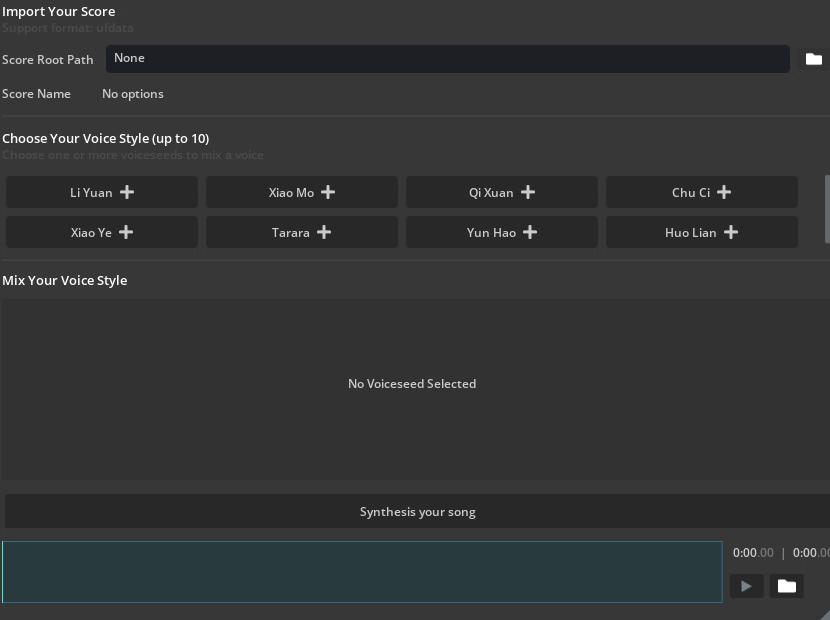
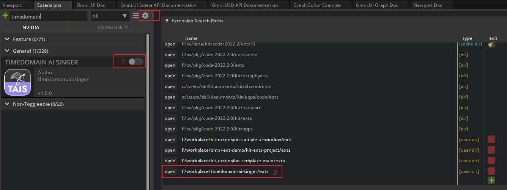
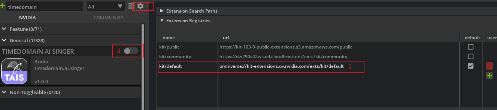
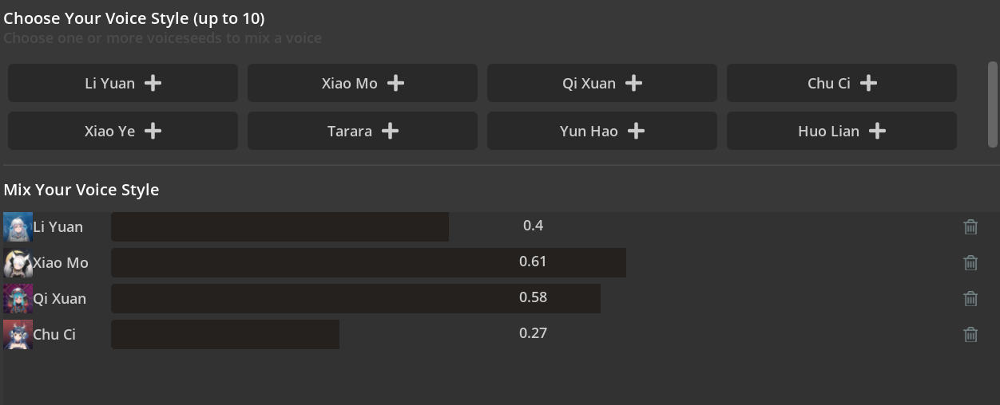

# Abstract
Timedomain AI Singer Omniverse Extension is a convenient tool for singing synthesis on the Omniverse platform.

FEATURES: 

- Create lifelike human singing voices with one click
- Choose from a rich variety of voice library
- Mix up to 10 singer voices to create your own singing 
- Support utafomatix file which can be converted from almost all kinds of singing score format

# About
TimedomAIn is a technology company that focuses on AI. We aim to make AI meet the emotional needs of human beings and endow AI with the ability to express emotion through “Rich-Emotion” human voice synthesis technology.
# Get started

## Add extension to Omniverse

1. **[Open extension manager]** After opening Omniverse Code, go to `Menu` -> `Window` -> `Extension`

2. **[Add this extension to Omniverse]** Click the   button and add absolute extension path to `Extension Search Paths`.

Finally, you can search `timedomain.ai.singer` and enable this extension.

> **Note**:
> the extension path to add is: `<your-path-to-timedomain-ai-singer>/exts`

3. **[We also need to add some dependencies]** Click the   button and add absolute extension path to `Extension Registries`.

> **Note**:
> the extension registries to add is: `omniverse://kit-extensions.ov.nvidia.com/exts/kit/default`

## Usage

Click the file button on the right to open the directory selection window, select the directory and the path will be displayed in the box. You can also paste the directory path directly to the display box.

Currently, only utafomatix files are available, and more file formats will be supported in the future.

> **Note**:
> the duration of the score must within 10 minutes

> **Note**:
> only the first track of the score will be synthesised

Once you have your score chosen, you can select a singer voice or mix singer voices:

> **Note**:
> up to 10 singer voices can be used for mixing 

Click "add" button to add a singer voice, move the slider (from 0 to 1) to adjust the similarity between the synthesis result and the chosen singer voice 

Finally, click "synthesis" button to send the request, the button will change to loading state when the request is being processed.

> **Note**:
> the frequency of the synthesis request is limited to 4 per minute

> **Note**:
> The synthesis time will increase according to the score duration

